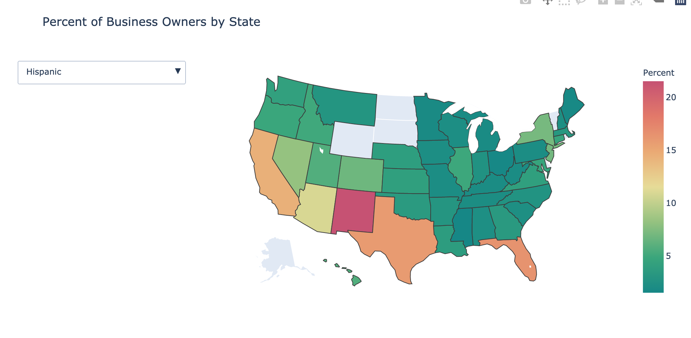
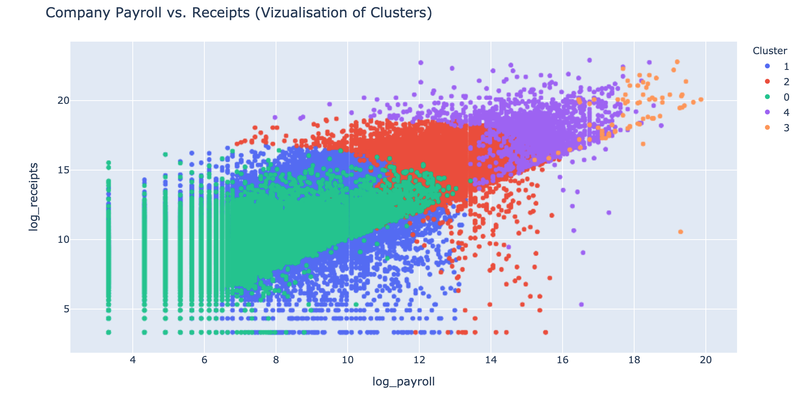

# Business Ownership Trends in the United States

### Foundational Questions: 
1. How is the minority representation in business ownership throughout industries changing?
2. Are there any states that have higher than average minority business ownership across all classes?
3. What other ways can businesses be clustered besides sector, and what is the minority breakdown across these clusters?

For this project I wil be examining the trends in business ownership in the United States. The data for this project was acquired through the United States Census Bureau's Survey of Business Owners. The Survey of Business Owners is conducted every 5 years. The Census Bureau publishes the summary statistics for each survey based on traits like race, ethnicity, education level, and whether a person was born in the United States. I will begin the project looking at trends in this data for the survey years 2002, 2007, and 2012. This data can be found [here](https://www.census.gov/programs-surveys/sbo/data/tables.html).

The Census Bureau has also releases a microdata sample for the year 2007. This sample contains data regarding the characteristics of individual businesses and their respective owners for about 1.5 million businesses. To protect the indentity of the businesses and their owners artificial noise is inserted into the dataset. Notably, this dataset also contains geographic information about each business as well as estimated for their employees, payroll, and receivables. This dataset can be found [here](https://www.census.gov/content/census/en/data/datasets/2007/econ/sbo/2007-sbo-pums.html).

## Visualization
Below are samples of this visualizations I created. The visualizations are interactive, but I addes some screenshot samples for this publication.

### 1. Overall Trends in Business Owership

### 2. Trends in Minoirty and Non-Minority Business Ownership by Sector

### 3. Percent of Minority Business Ownership by State

## Clustering
In this section, I want to explore creating clusters for different types of businesses based on traits like employment, payroll, receivalbles, whether the business was family owned, and so on. I then wanted to determine the breakdown of different characteristics of business owners by cluster. 

For this problem I decided to use K-Protoypes Clustering. This algorithm is a mixture of K-Means and K-Modes, and fits this problem well because it can cluster based on both numerical and categorical data. A downside of this algorithm is the computational complexity as you increase the number of data. Without a gpu and hours/days to train the model, I was not able to cluster based on all 1.5 million datapoints. Instead, I had to take random samples of the data. The most I could train with given the limitations of my hardware was 10,000, even after I split the work between all 6 of the processor cores on my laptop.

### Cluster Breakdown

#### Cluster 0:
Number of buinesses: 449927, Traits: Far below average employees, payroll and receivables; Most often is home-based, but not family owned or a franchise

#### Cluster 1: 
Number of buinesses: 572374, Traits: Slightly below average employees, payroll and receivables; More often is not family-owned, home-based, or a franchise. 

#### Cluster 2: 
Number of buinesses: 20747, Traits: Slightly above average employees, payroll and receivables; More often is not family-owned, home-based, or a franchise

#### Cluster 3:
Number of buinesses: 80, Traits: Far above average employees and receivables with slightly above average payroll; Most often is not family-owned, home-based, or a franchise.

#### Cluster 4:
Number of buinesses: 1683, Traits: High above average employees, payroll and receivables; More often is not family-owned, home-based, or a franchise. 

### Minority Representation by Cluster
#### Minority

#### Born in the United States

## Conclusion

The purpose of this project was to paint broad strokes about patterns that arise in business ownership in the United States. While we were interested in general trends, like the how the number of business owners were changing in certain sectors, the main goal of was to identify patterns in the demographics of business owners. 

In terms of the trend from 2002 to 2012, we observed many different combination of outcomes. For some sectors, like information and technology, both minority and non-minority ownership was increasing. In others, like real estate, both minority and nonminority ownership was increasing, but nonminority ownership was increading much faster. Yet another outcome was the instance of minority ownership increasing and non-minority ownership decreasing.

We also observed trends in geographic trends in the data. One takeway was that even in states with high minoirty populations, one minority would tend to have a much larger presence in business ownership than the others. This points to the observation that while the United States is anecodotally considered a "melting pot", business ownership tends to stratify rather than mix together. 

Another important finding was was the demographic distribution amongst the clusters different types of businesses. While minorities make up about 18 percent of all business owners, they make up only about 5.6 percent of the owners of businesses belonging to cluster 4 (generally larger companies). Whether this discrepancy is a result of certain societal blockades towards minorities owning these more "successful" companies cannot be answered by this dataset, but the discrepancy is certainly there.  

While I consider the research into this topic successful, there are definitely ways to improve. For one, I didn't have the hardware to take full advantage of the K-prototypes clustering algorithm. My ability to cluster was limited to random samples of data and all feature selection was done on a trial and error basis.
Addtionally, data on this topic is not as readily available as I believe it should be. As a result of this. I was limited to using data from 2007 to create clusters, as this was the only sizeable dataset available to the public.

The data for this project is published on [Zenodo]() and the code is on [Github](https://github.com/nickblackmore/DATS-6103-Individual-Project-3-Nicholas-Blackmore). 
